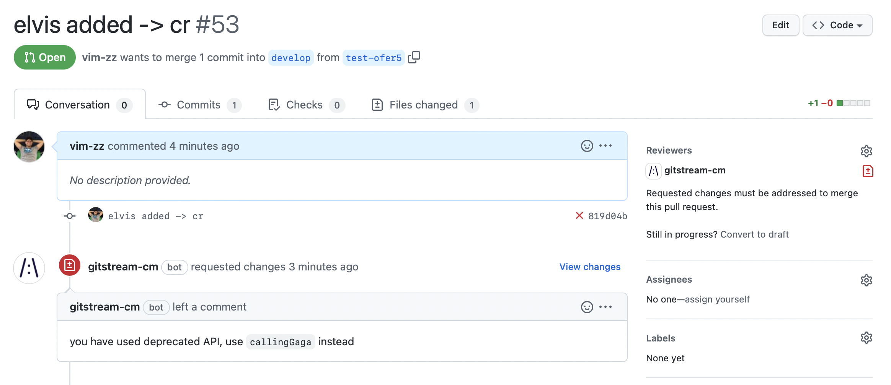

# Examples


## Label big PRs

Automatically add a label to PRs that are very small to get faster reviewer response.

```yaml title=".cm/gitstream.cm"
automations:
  mark_good_pr:
    if:
      - {{ branch.diff.size <= 100 }}
      - {{ files | length <= 100 }}
    run:
      - action: add-labels@v1
        args:
          labels: [good_size]
  mark_big_pr:
    if:
      - {{ branch.diff.size > 100 }}
    run:
      - action: add-labels@v1
        args:
          labels: [big_size]
```


## Add Estimated Time for Review 

Automatically add a comment to all PRs with the estimated time for review to get faster reviewer response.

```yaml title=".cm/gitstream.cm"
automations:
  etr_on_all:
    if:
      - true
    run:
      - action: add-comment@v1
        args:
          comment: "Estimated {{ branch | estimatedReviewTime }} minutes to review"
```


## Check and approve documents changes  

Automatically add a comment to all PRs with the estimated time for review to get faster reviewer response.

```yaml title=".cm/gitstream.cm"
automations:
  approve_docs:
    if:
      - {{ files | allDocs }}
    run:
      - action: approve@v1
```


## Require 2 approvals for complex changes 

Automatically require 2 reviewers for PRs that has more than 100 lines of code changed under the `src` directory.

```yaml title=".cm/gitstream.cm"
automations:
  double_review:
    if:
      - {{ branch | estimatedReviewTime >= 30 }}
      - {{ files | length >= 10 }}
      - {{ files | match(regex='src\\/') | some }}
    run:
      - action: set-required-approvals@v1
        args:
          reviewers: 2
```


## Check and approve indentation changes

For PRs that include only code format change, approve merge automatically.

```yaml title=".cm/gitstream.cm"
automations:
  allow_formatting:
    if:
      - {{ files | extensions | match(list=['js', 'ts']) | every }}
      - {{ source.diff.files | isFormattingChange }}
    run:
      - action: approve@v1
      - action: add-labels@v1
        args:
          labels: [code-formatting]

```

!!! note

    Multiple actions can be listed in a single automation. The actions are invoked one by one.
    
    Multiple conditons can be listed for a single automation. All listed conditions must pass to triger the actions.


## Request change when using deprecated APIs

For example, assume we have an old API `oldCall` we want to switch from to a new API `newCall`, gitStream can review and trigger a change request automatically when the PR includes use of the deprecated API.

```yaml title=".cm/gitstream.cm"
automations:
  catch_deprecated:
    if:
      # Given the PR code changes, check if a call to an unwanted API was introduced
      - {{ source.diff.files | matchDiffLines(regex='^[+].*callingElvis\\(') | some }}
    run:
      - action: request-changes@v1
        args:
        comment: |
          Deprecated API used `callingElvis`, use `callingGaga` instead
```




## Approve additional tests automatically

You can use map to check that a PR was about adding more tests.

```yaml title=".cm/gitstream.cm"
automations:
  tests_safe_changes:
    if:
      # Given the PR files changes, check that only tests were changed. The allTests filter checks for 
      # the substring `test` or `spec` in the file path or file name.
      - {{ files | allTests }}
      # Checking `changes.ratio` which is calculated below
      - {{ changes.ratio > 0.8 }}
    run: 
      - action: add-labels@v1
        args:
          labels: ['tests-changes']
      - action: add-comment@v1
        args:
          comment: |
            PR added tests (ratio: {{ changes.ratio }})
      # - action: approve@v1

# You can add more sections to the .cm file to place more logic, and use it in your automations
# The following logic `ratio` result is used in the automation above by checking `changes.ratio`
changes:
  # Sum all the line added/edited in the PR
  additions: {{ branch.diff.files_metadata | map(attr='additions') | sum }}
  # Sum all the line removed in the PR
  deletions: {{ branch.diff.files_metadata | map(attr='deletions') | sum }}
  # Calculate the ratio to check if it is about new code
  ratio: {{ changes.additions / (changes.additions + changes.deletions) }}
```

As a result, if you add test cases to your repo, gitStream can automatically check that and approve the PR automatically.


