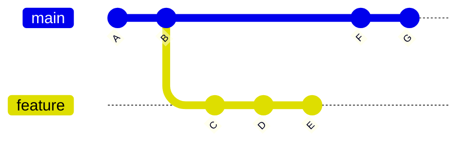
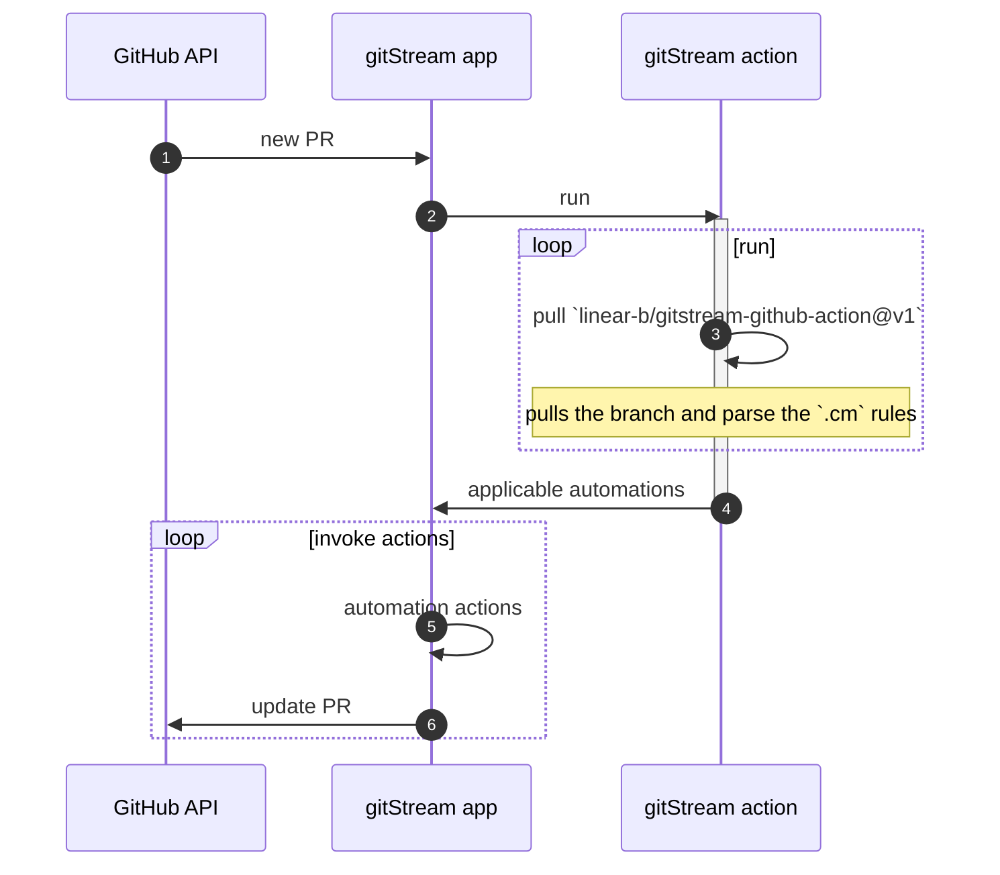

# How it works

Every time a dev opens a new Pull Request or changes a Pull Request, gitStream is triggered. Next, the `.cm` file is used to determine which automatic actions are invoked based on their conditions. The resulting actions use GitHub API to achieve the desired outcome.

Next steps are common practice of changing code in repo:

1. Create a feature branch 
2. Commit changes  
3. Push branch to remote repo 
4. Open Pull Request 

When a new PR is opened, several different actors are running:

1. GitHub API
2. gitStream app which you have installed from the marketplace 
3. Repo action that was placed in `.github/workflows/gitstream.yml`
4. gitStream runner action `linear-b/gitstream-github-action@v1`

Once a new PR is opened (or changed) the following process occurs:

1. gitStream gets event for the new PR 
2. gitStream calls the installed action in `.github/workflows/gitstream.yml`
3. The installed action pulls and runs gitStream action `linear-b/gitstream-github-action@v1`. This action runs locally in the repo and relies on 
    1. The provided PR context, gitStream compares the current branch agains the most recent common commit with the main branch.
    2. The repos automations as defined in `.cm/gitstream.cm`
4. It sends the list of applicable automations to the gitStream GitHub app
5. gitStream GitHub app iterates over the automations and invokes each action using GitHub APIs
6. The PR gets updated according to the desired automations

At the end The PR is ready for further review or merge.

The following diagram describes the flow:

## Automation results

Eventually, the gitStream app shows the following statuses:  

- Success - when the applicable automation finished and PR is good to go 
- Neutral - when there aren't any applicable automations for the PR
- Failed - when the applicable automation finished without completion