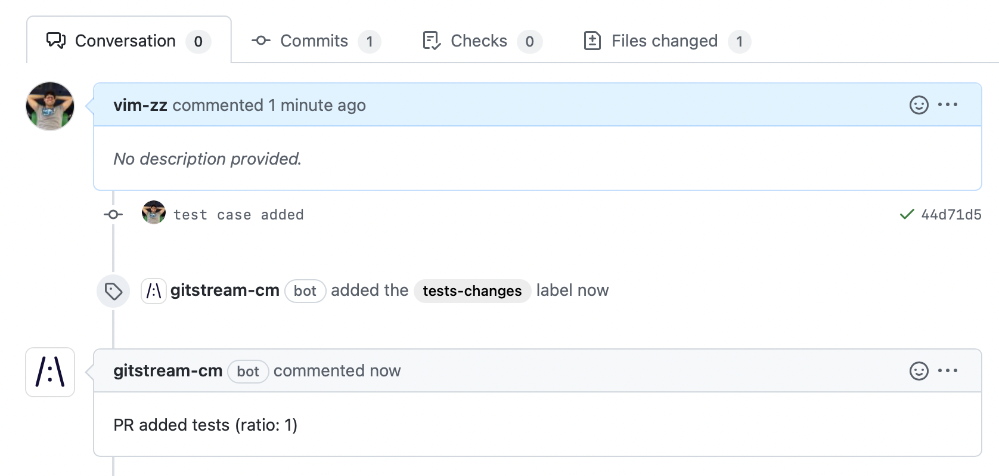

# Examples


## Label PRs by their complexity

Automatically add a label to PRs with their Estimated Time to Review and a matching color.

```yaml+jinja title=".cm/gitstream.cm"
automations:
  estimated_time_to_review:
    if:
      - true
    run:
      - action : add-label@v1
        args:
          label: "{{ calc.etr }} min review"
          color: {{ 'E94637' if (calc.etr >= 20) else ('FBBD10' if (calc.etr >= 5) else '36A853') }}

# To simplify the automation, this calculation is placed under a unique YAML key.
# The result is is assigned to `calc.etr` which is used in the automation above.
# You can add as many keys as you like.
calc:
  etr: {{ branch | estimatedReviewTime }}
```

## Approve safe changes  

PRs that include only documentations changes are verified and approved by gitStream. In the example below, marked in yellow, the `files` context is checked by `allDocs` filter that verifies there are only document files. PRs that pass the check are approved by gitStream.

```yaml+jinja title=".cm/gitstream.cm" hl_lines="4"
automations:
  safe_changes:
    if:
      - {{ is.formatting or is.docs or is.tests }}
    run: 
      - action: add-labels@v1
        args:
          labels: ['safe-changes']
      - action: approve@v1

# To simplify the automation, this calculation is placed under a unique YAML key.
# The result is is assigned to `is.formatting`, `is.docs` and `is.tests` which is 
# used in the automation above. You can add as many keys as you like.
is:
  formatting: {{ source.diff.files | isFormattingChange }}
  docs: {{ files | allDocs }}
  tests: {{ files | allTests }}
```

## More approvals for complex changes 

Automatically require 2 reviewers for PRs that have more than 100 lines of code changed under the `src` directory.

```yaml+jinja title=".cm/gitstream.cm"
automations:
  double_review:
    if:
      - {{ branch | estimatedReviewTime >= 30 }}
      - {{ files | length >= 10 }}
      - {{ files | match(regex=r/src\//') | some }}
    run:
      - action: set-required-approvals@v1
        args:
          reviewers: 2
```

## Validate formatting changes only for JavaScript/TypeScript

For PRs that include only code format change, approve merge automatically. The automation includes 2 actions that both are executed, one after another, when all conditions pass.

```yaml+jinja title=".cm/gitstream.cm" hl_lines="7-8"
automations:
  allow_formatting:
    if:
      - {{ files | extensions | match(list=['js', 'ts']) | every }}
      - {{ source.diff.files | isFormattingChange }}
    run:
      - action: approve@v1
      - action: add-label@v1
        args:
          label: code-formatting

```

!!! note

    Multiple actions can be listed in a single automation. The actions are invoked one by one.
    
    Multiple conditions can be listed for a single automation. All listed conditions must pass to trigger the actions.


## Request changes on deprecated APIs

For example, assume we have an old API `callElvis` we want to switch from to a new API `callGaga`, gitStream can review and trigger a change request automatically when the PR includes use of the deprecated API.

```yaml+jinja title=".cm/gitstream.cm" 
automations:
  
  # Automation names should be unique, therefore the iteration number postfix
  catch_deprecated_components_{{ loop.index }}:
    if:
      - {{ source.diff.files | matchDiffLines(regex=item.regex) | some }}
    run:
      - action: add-label@v1
        args:
          label: 'deprecated-component'
          color: '#FF0000'
      - action: request-changes@v1
        args:
          comment: |
            `{{ item.old }}` component is deprecated, use `{{ item.new }}` instead
  

# This list includes the deprecated items
deprecated:
  - regex: r/callElvis/
    old: Elvis
    new: Gaga
  - regex: r/callOldAPI/
    old: callOldAPI
    new: callBetterAPI
```


## Approve additions to tests

You can use map to check that a PR was about adding more tests.

```yaml+jinja title=".cm/gitstream.cm" hl_lines="23 25"
automations:
  tests_safe_changes:
    if:
      # Given the PR files changes, check that only tests were changed. The allTests filter checks for 
      # the substring `test` or `spec` in the file path or file name.
      - {{ files | allTests }}
      # Checking `changes.ratio` which is calculated below
      - {{ changes.ratio > 0.8 }}
    run: 
      - action: add-label@v1
        args:
          label: 'tests-changes'
      - action: add-comment@v1
        args:
          comment: |
            PR added tests (ratio: {{ changes.ratio }})
      # - action: approve@v1

# You can add more sections to the .cm file to place more logic, and use it in your automations
# The following logic `ratio` result is used in the automation above by checking `changes.ratio`
changes:
  # Sum all the line added/edited in the PR
  additions: {{ branch.diff.files_metadata | map(attr='additions') | sum }}
  # Sum all the line removed in the PR
  deletions: {{ branch.diff.files_metadata | map(attr='deletions') | sum }}
  # Calculate the ratio to check if it is about new code
  ratio: {{ changes.additions / (changes.additions + changes.deletions) }}
```

As a result, if you add test cases to your repo, gitStream can automatically check that and approve the PR automatically.



## Approve changes to prints

When you just want to change the way to print to screen, you can get it approved as long as you didn't change anything else.

```yaml+jinja title=".cm/gitstream.cm" 
automations:
  # for JavaScript
  prints_changes_in_js:
    if: 
      - {{ files | match(regex=r/\.js$|\.ts$/) | every }}
      - {{ files | length == 1 }}
      - {{ source.diff.files | matchDiffLines(regex=r/^[+-].*console\.log/, ignoreWhiteSpaces=true) | every }}
    run: 
      - action: add-label@v1
        args:
          label: 'prints-changes'
	    - action: approve@v1

  # for Python
  prints_changes_in_py:
    if: 
      - {{ files | match(regex=r/\.py$/) | every }}
      - {{ files | length == 1 }}
      - {{ source.diff.files | matchDiffLines(regex=r/^[+-].*logger\.(trace|debug|info|warn|error)/, ignoreWhiteSpaces=true) | every }}
    run: 
      - action: add-label@v1
        args:
          label: 'prints-changes'
	    - action: approve@v1
```
