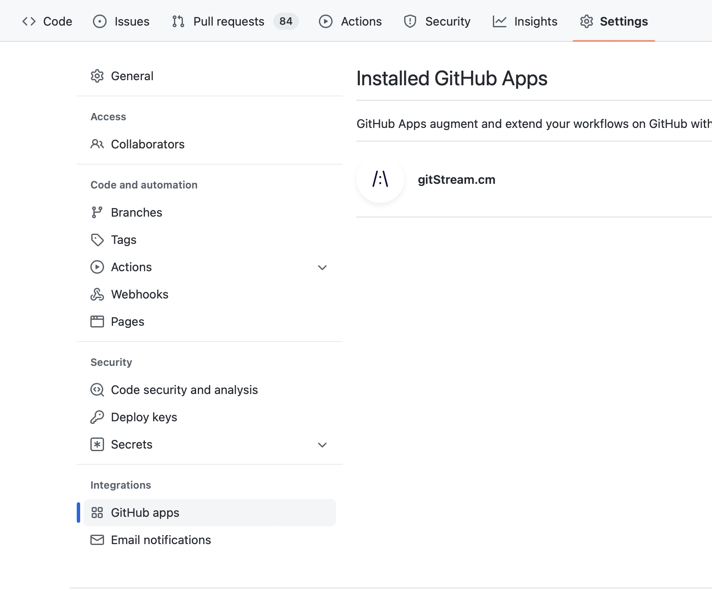
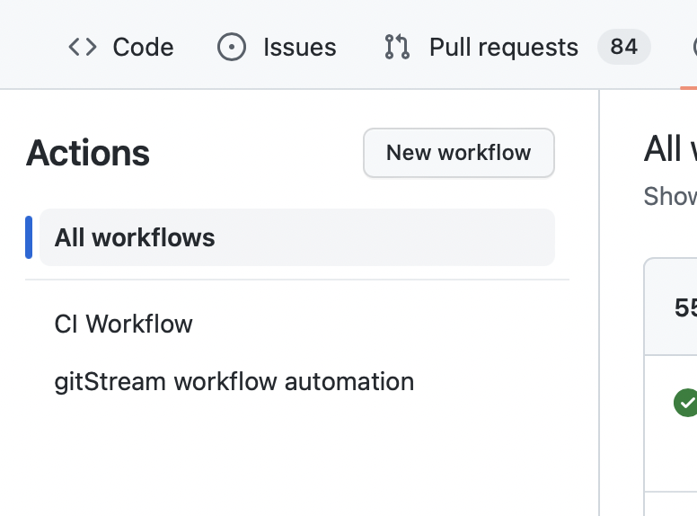
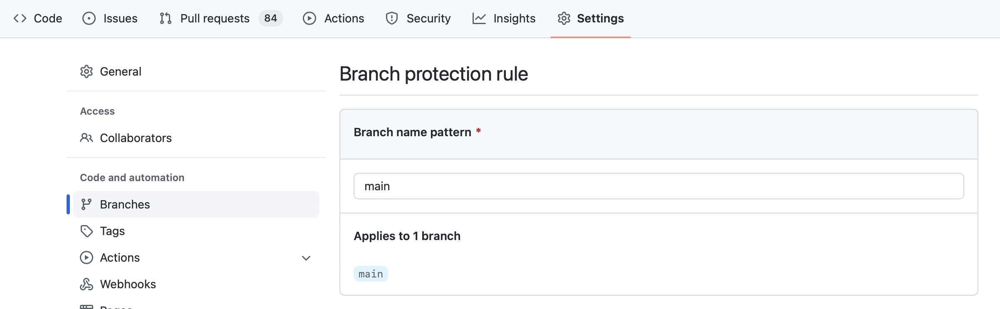
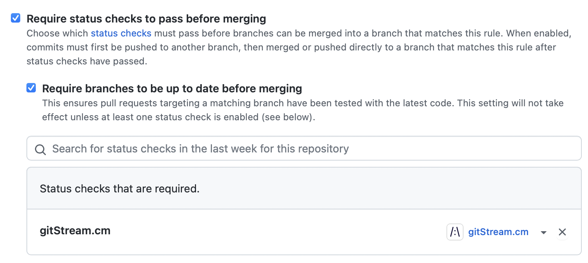

# Troubleshooting 

## I can't see any action running

**Did you install gitStream in your repo?**
Check that you see gitStream app on repository's Settings > GitHub apps:

In case you don't see it, visit the marketplace and install it for free: https://github.com/marketplace/gitstream-by-linearb

**Did you set the workflow files correctly?**
Check you have placed these 2 files in your repository, with these exact names: 
1. `.cm/gitstream.cm`
2. `.github/workflows/gitstream.yml`

These files needs to be commited to the repository default branch (usually `master` or `main`).

Check that you see "gitStream workflow automation" on the Action section in your repository:

## I can't set gitStream as required check

In order for gitStream to be listed as a required check, it needs to be triggered at least once in that repo. First create a new PR so gitStream is triggered.

Check it under repository's Settings > Branches: 

